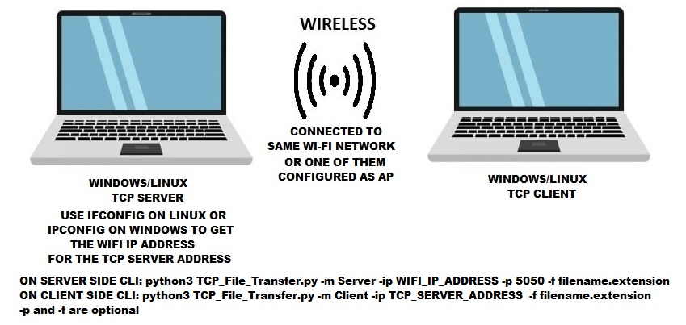

# Wireless-TCP-File-Transfer Description
File Transfer via Wi-Fi over TCP socket


### Usage 
```
usage: TCP_File_Transfer.py [-h] -m MODE -ip SERVER_IP [-p SERVER_PORT] [-f FILE_LOCATION]  
optional arguments:                                                                                                                       
-h, --help            show this help message and exit                                                                                   
-m MODE, --mode MODE  MODE: Server or Client                                                                                            
-ip SERVER_IP, --server_ip SERVER_IP   SERVER_IP: e.g. 192.168.1.10                                                                                      
-p SERVER_PORT, --server_port SERVER_PORT  SERVER_PORT: e.g. 5050                                                                                            
-f FILE_LOCATION, --file_location FILE_LOCATION  FILE_LOCATION: e.g. Linux: /home/user/filename.extension or Windows: C:\Users\Desktop\filename.extension  

```
**Execute the commands in the following Order:** 

``` 
1. Start the Server 
2. Start the Client.
3. Select the Receive Files option first on either Server or Client.
4. Send the files via Send files option on the other end.

**Note: Check ifconfig on Linux or ipconfig on Windows for the Wi-Fi IP address. Use this IP address as the TCP SERVER_IP** 
```